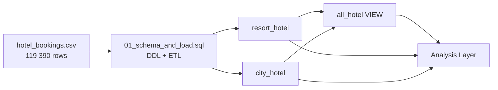

<p align="center">
  
</p>

---

# Technical Documentation

## 1. Project Overview

This repository contains a data analytics project focused on hotel booking patterns and cancellations for two hotels in Portugal.

The goal is to:
- Analyze booking cancellation behavior and its key drivers (lead time, deposit type, market segment, seasonality).
- Identify revenue optimization levers through ADR (Average Daily Rate) trends and room upgrade patterns.
- Understand demand patterns by guest origin, booking channel, and stay profile.

Technically, this project demonstrates:
- Structured SQL schema design with type enforcement, constraints, and data normalization.
- ETL from raw CSV data into typed, validated SQL tables (SQL Server).
- A clear separation between **raw data**, **schema & load**, and **analytical queries**.

---

## 2. High-Level Architecture



### Key ideas:

- The core dataset (`hotel_bookings.csv`) contains 119 390 bookings across two hotels in Portugal.
- `01_schema_and_load.sql` handles the DDL layer (table creation, type casting, constraints) and data loading from the raw source table.
- The raw dataset is split into two typed, validated tables: `resort_hotel` and `city_hotel`.

---

## 3. Data Sources

**`Data/hotel_bookings.csv`** — 119 390 rows, sourced from a published research paper on hotel booking demand.

Both hotels are located in **Portugal**:
| Hotel | Type | Location |
|---|---|---|
| Resort Hotel | Beach / leisure resort | Algarve region (Faro area) |
| City Hotel | Urban business hotel | Lisbon |

---

## 4. Repository Structure

```
├── src/
│   └── hotel_bookings.csv                          # Core raw dataset (119 390 rows, source table)
│
├── docs/
│   ├── data_dictionary.md                          # Column-level definitions for all tables
│   └── data_catalogue.md                           # Inventory of all tables, sources, lineage, and EDA findings
│
├── 01_schema_and_load.sql                          # DDL (CREATE TABLE, constraints) + ETL (INSERT INTO SELECT)
├── 02_eda_exploratory.sql                          # Exploratory Data Analysis — distributions, stats, hypotheses
├── 03_nettoyage_des_données_city_hotel.sql         # Data cleaning — city_hotel (NULLs, outliers, computed columns)
├── 04_nettoyage_des_données_resort_hotel.sql       # Data cleaning — resort_hotel (NULLs, outliers, computed columns)
│
└── README.md                                       # Technical documentation (this file)
```

---

## 5. Schema Design

### 5.1 Raw Table — `hotel_bookings`

The raw table is imported directly from `hotel_bookings.csv` with minimal typing. It serves as the single source of truth for all downstream transformations.

### 5.2 Typed Tables — `resort_hotel` & `city_hotel`

The raw table is split into two validated, typed tables — one per hotel. Both share the same structure:

| Column | Type | Source Column | Notes |
|---|---|---|---|
| `booking_id` | `INT IDENTITY(0,1)` | — | Auto-generated surrogate key |
| `hotel` | `VARCHAR(20)` | `hotel` | Enforced by CHECK constraint |
| `is_canceled` | `BIT` | `is_canceled` | 0 = not canceled, 1 = canceled |
| `lead_time_in_days` | `INT` | `lead_time` | Days between booking and arrival |
| `arrival_date` | `DATE` | `arrival_date_year` + `arrival_date_month` + `arrival_date_day_of_month` | Reconstructed from 3 source columns |
| `arrival_week_nb` | `INT` | `arrival_date_week_number` | ISO week number |
| `nb_of_weekend_nights` | `INT` | `stays_in_weekend_nights` | |
| `nb_of_week_nights` | `INT` | `stays_in_week_nights` | |
| `adults` | `INT` | `adults` | |
| `children` | `INT` | `children` | `TRY_CAST` — source contains `'NA'` values; 4 NULLs filled with `babies` value |
| `babies` | `INT` | `babies` | 1 outlier corrected (10 → 1) |
| `meal` | `VARCHAR(10)` | `meal` | CHECK: FB, HB, SC, BB, Undefined |
| `country_of_origin` | `VARCHAR(5)` | `country` | ISO 3166-1 alpha-3 |
| `market_segment` | `VARCHAR(20)` | `market_segment` | |
| `distribution_channel` | `VARCHAR(20)` | `distribution_channel` | CHECK constraint enforced |
| `repeated_guest` | `BIT` | `is_repeated_guest` | 0 = new guest, 1 = returning |
| `nb_of_booking_cancelled` | `INT` | `previous_cancellations` | Guest's cancellation history |
| `nb_of_booking_not_cancelled` | `INT` | `previous_bookings_not_canceled` | |
| `reserved_room_type` | `VARCHAR(1)` | `reserved_room_type` | Letter code (A–L) |
| `assigned_room_type` | `VARCHAR(1)` | `assigned_room_type` | Tracks upgrades / downgrades — typo corrected from `assigned_romm_type` |
| `nb_of_changes_into_the_booking` | `INT` | `booking_changes` | Number of modifications before arrival |
| `deposit_type` | `VARCHAR(10)` | `deposit_type` | CHECK: No Deposit, Refundable, Non Refund |
| `travel_agency_id` | `INT` | `agent` | `TRY_CAST` — source is VARCHAR with NULLs |
| ~~`company_id`~~ | ~~`INT`~~ | ~~`company`~~ | **Dropped** — 95 % NULLs on city_hotel (75 641 / 79 330), 92 % on resort_hotel (36 952 / 40 060) |
| `days_in_waiting_list` | `INT` | `days_in_waiting_list` | |
| `customer_type` | `VARCHAR(20)` | `customer_type` | CHECK constraint enforced |
| `average_daily_rate` | `DECIMAL(18,2)` | `adr` | Revenue per night in EUR — city_hotel: 1 outlier corrected (5 400 → 540); resort_hotel: negative values kept (billing corrections, to filter at analysis layer) |
| `nb_of_carpark_required` | `INT` | `required_car_parking_spaces` | |
| `nb_of_special_requests` | `INT` | `total_of_special_requests` | |
| `reservation_status` | `VARCHAR(15)` | `reservation_status` | CHECK: Check-Out, Canceled, No-Show |
| `reservation_status_date` | `DATETIME` | `reservation_status_date` | Date of last status change |
| `nb_total_of_booking` | Computed | `nb_of_booking_cancelled + nb_of_booking_not_cancelled` | Total booking history per guest |
| `lead_time_segment` | Computed PERSISTED | `lead_time_in_days` | Buckets: Same Day / Last Minute / Short / Medium / Long / X Long / XXL |
| `total_revenue` | Computed PERSISTED | `(nb_of_weekend_nights + nb_of_week_nights) * average_daily_rate` | Estimated revenue per booking in EUR |

### 5.3 Key Design Decisions

- **Date reconstruction** — `arrival_date` is built from three raw columns using `DATEFROMPARTS()`. The month column is stored as English text (`'July'`), requiring `SET LANGUAGE English` and a `CAST('01 ' + month + ' 2000' AS DATE)` conversion.
- **TRY_CAST** — `children`, `agent`, and `company` are stored as `VARCHAR` in the raw table with `'NA'` or `NULL` strings. `TRY_CAST` converts them to `INT` and silently returns `NULL` on failure.
- **CHECK constraints** — Applied on `hotel`, `meal`, `distribution_channel`, `deposit_type`, `customer_type`, and `reservation_status` to enforce domain integrity.
- **IDENTITY(0,1)** — `booking_id` starts at 0 and is a surrogate key only; it is not meaningful as a business identifier (identity values are not rolled back on failed inserts in SQL Server).

---

## 6. Analysis Scope

### 6.1 Cancellation Analysis
- Cancellation rate by hotel type, market segment, deposit type, lead time bucket.
- Impact of previous cancellation history on future behavior.
- Seasonal cancellation patterns.

### 6.2 Revenue & Pricing
- ADR trends by hotel, room type, customer segment, season.
- Room upgrade/downgrade rate (`reserved_room_type` vs `assigned_room_type`).
- Revenue impact of cancellations (no-shows, last-minute cancellations).

### 6.3 Demand Patterns
- Guest origin distribution (country-level mapping).
- Booking channel performance (market segment × distribution channel).
- Special requests and parking demand as proxy for guest profile.

### 6.4 EDA — Key Findings & Hypotheses

Preliminary EDA (`eda_preleminaire.sql`) confirmed the following facts and generated a first set of testable hypotheses. Cross-dimension analysis then confirmed or revised several of them.

#### Univariate — confirmed facts

| Metric | City Hotel | Resort Hotel |
|---|---|---|
| Rows | 79 330 | 40 060 |
| No-Deposit share | 83.8 % | 95.4 % |
| Cancellation rate | 40.6 % | 27.0 % |
| No-Show rate | 1.2 % | 0.7 % |
| Lead time — mean / median | 109.74 / 74 days | 92.68 / 57 days |
| Lead time — std dev | 110.95 days | 97.29 days |
| Booking changes — mean / max | 0.19 / 21 | 0.29 / 17 |
| ADR — mean / median | 105.30 / 99.90 € | 94.95 / 75.00 € |
| ADR — min | 0.00 € | **-6.38 €** |
| ADR — max | **5 400.00 €** | 508.00 € |

**Data quality flags:**
- `resort_hotel.average_daily_rate` contains negative values (min = -6.38) — likely billing corrections.
- `city_hotel.average_daily_rate` contains zero values and a max of 5 400 € — outliers to investigate.
- Booking changes: mean ≈ 0 but max = 17–21, indicating a tail of highly-modified reservations.

#### Cross-dimension analysis — deposit_type × customer_type

| deposit_type | customer_type | City Hotel nb | Resort Hotel nb |
|---|---|---|---|
| No Deposit | Transient | 48 101 | 28 583 |
| No Deposit | Transient-Party | 16 288 | 7 570 |
| No Deposit | Contract | 1 760 | 1 770 |
| Non Refund | Transient | 11 290 | 1 619 |
| Non Refund | Transient-Party | 1 038 | 96 |
| Refundable | (all types) | ~20 | ~142 |

"No Deposit" bookings are dominant across all customer types and drive the majority of revenue on both hotels.

#### Cross-dimension analysis — deposit_type × reservation_status

| deposit_type | reservation_status | City Hotel | Resort Hotel |
|---|---|---|---|
| No Deposit | Check-Out | 46 198 | 28 749 |
| No Deposit | Canceled | 19 344 | 9 178 |
| No Deposit | No-Show | 900 | 272 |
| Non Refund | Canceled | **12 828** | **1 632** |
| Non Refund | Check-Out | 24 | 69 |
| Non Refund | No-Show | 16 | 18 |
| Refundable | Check-Out | 6 | 120 |
| Refundable | Canceled | 14 | 21 |

**Key observations:**
- "Non Refund" bookings cancel at ~99.8 % rate on city_hotel and ~95.5 % on resort_hotel — counterintuitive and requires investigation (possible revenue recognition or retroactive classification).
- No-Show events are overwhelmingly concentrated in "No Deposit" bookings, confirming H1.
- "Refundable" bookings are nearly absent on city_hotel, suggesting business-travel guests accept uncertainty rather than paying a refundable premium.
- Resort hotel could potentially benefit from revised Non-Refund deposit conditions.

#### Data Cleaning Decisions — resort_hotel (`04_nettoyage_des_données_resort_hotel.sql`)

| Decision | Detail |
|---|---|
| `company_id` dropped | 36 952 NULLs / 40 060 rows (92 %) |
| `assigned_romm_type` renamed | Typo corrected → `assigned_room_type` |
| `children` NULLs filled | 4 NULLs replaced by `babies` value (harmonization with city_hotel) |
| `children = 10` corrected to `1` | Single No-Show row — likely data entry error |
| `average_daily_rate` negatives kept | Likely billing corrections — to be filtered at analysis layer (H5 open) |
| `nb_total_of_booking` added | Computed: `nb_of_booking_cancelled + nb_of_booking_not_cancelled` |
| `lead_time_segment` added (PERSISTED) | 7 buckets: Same Day / Last Minute / Short / Medium / Long / X Long / XXL |
| `total_revenue` added (PERSISTED) | Computed: `(nb_of_weekend_nights + nb_of_week_nights) * average_daily_rate` |

**Emerging patterns (resort_hotel cleaning phase):**
- Travel agents (Offline TA/TO, Groups) concentrate the highest volumes of previous cancellations — bulk pre-booking and release behaviour suspected.
- Guests with more prior non-cancellations → less likely to cancel (same pattern as city_hotel).
- Longer lead time → more likely to cancel (same pattern as city_hotel).

---

#### Hypotheses

| # | Hypothesis | Status |
|---|---|---|
| H1 | No-Shows are almost exclusively "No Deposit" bookings | **Confirmed** — 900 / 916 city, 272 / 291 resort |
| H2 | "Non Refund" deposit reduces cancellation rate | **Revised** — Non Refund shows ~99 % cancellation; mechanism to investigate |
| H3 | High-modification bookings are more likely to cancel | **Partially revised** — observation suggests more changes → less cancellation; to quantify |
| H4 | High special-request count correlates with high modification count | Open — next step: `nb_of_special_requests` × `nb_of_changes_into_the_booking` |
| H5 | Negative ADR rows in `resort_hotel` are billing corrections | Open — `WHERE average_daily_rate < 0` investigation |
| H6 | Zero ADR rows represent complimentary stays or data errors | Open — `WHERE average_daily_rate = 0` investigation |
| H7 | Non Refund classification may be retroactive (post-cancellation) rather than predictive | Open — requires checking `reservation_status_date` vs `arrival_date` |
| H8 | City hotel cancellation rate higher than resort due to business-travel flexibility | Open — cross-tab `hotel × market_segment × is_canceled` |
| H9 | Guests with more previous non-cancellations are less likely to cancel current booking | **Observed** — pattern visible in data; to quantify with cancellation rate by `nb_of_booking_not_cancelled` bucket |
| H10 | Longer lead time increases cancellation probability | **Observed** — visual pattern confirmed; to quantify with `lead_time_segment × is_canceled` |

---

## 7. Planned

- External enrichment with historical weather data (Faro for Resort Hotel, Lisbon for City Hotel) to correlate demand and cancellations with meteorological conditions.
- Events dataset integration (public holidays, major regional events in Algarve and Lisbon).
- Interactive dashboard (Streamlit or Power BI) with filters by hotel, period, market segment.
- Cancellation prediction model (logistic regression or gradient boosting baseline).

---

## 8. Installation & Local Execution

```bash
# 1. Clone the repository
git clone https://github.com/JBaptisteAll/Hotel_Booking_Analysis.git
cd Hotel_Booking_Analysis

# 2. Load the raw dataset into SQL Server
# Import Data/hotel_bookings.csv into a table named `hotel_bookings`
# (use SQL Server Import Wizard or bcp)

# 3. Run the schema & load script
# Execute 01_schema_and_load.sql in SSMS or Azure Data Studio
# Note: SET LANGUAGE English is required at the top of the session
```

---

## 9. Contact
For questions or collaboration, please contact the project owner via GitHub or LinkedIn.
