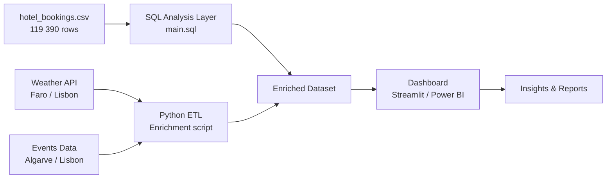

<p align="center">
  
</p>

---

# Technical Documentation

## 1. Project Overview

This repository contains a data analytics project focused on hotel booking patterns and cancellations for two hotels in Portugal, enriched with weather and local events data to identify demand drivers and revenue optimization opportunities.

The goal is to:
- Analyze booking cancellation behavior and its key drivers (lead time, deposit type, market segment, seasonality).
- Identify revenue optimization levers through ADR (Average Daily Rate) trends and room upgrade patterns.
- Correlate booking demand with external factors: weather conditions and local events specific to each hotel's location.
- Produce actionable insights on demand forecasting and pricing strategy.

Technically, this project demonstrates:
- Structured SQL analysis on a large real-world hospitality dataset.
- External data enrichment (weather API, events data) correlated at the hotel-location level.
- A clear separation between **raw data**, **analytical queries**, and **reporting layer**.

---

## 2. High-Level Architecture



### Key ideas:

- The core dataset (`hotel_bookings.csv`) contains 119 390 bookings across two hotels in Portugal.
- SQL queries handle the analytical layer: cancellation analysis, ADR trends, segmentation.
- A Python ETL script enriches the dataset with historical weather and local events data, matched per hotel location.
- A dashboard (Streamlit or Power BI, TBD) exposes interactive analysis to the end user.

---

## 3. Data Sources

### 3.1 Core Dataset

**`Data/hotel_bookings.csv`** — 119 390 rows, sourced from a published research paper on hotel booking demand.

Both hotels are located in **Portugal**:
| Hotel | Type | Location |
|---|---|---|
| Resort Hotel | Beach / leisure resort | Algarve region (Faro area) |
| City Hotel | Urban business hotel | Lisbon |

This geographic context is critical for the weather and events enrichment: weather data is fetched for **Faro** (Resort Hotel) and **Lisbon** (City Hotel) separately.

### 3.2 External Enrichment (Planned)

| Source | Purpose | Hotel |
|---|---|---|
| Weather API (historical) | Correlate booking demand / cancellations with temperature, rainfall, sunshine hours | Both (Faro / Lisbon) |
| Local events data | Identify demand spikes linked to festivals, public holidays, sporting events | Both |

---

## 4. Repository Structure

```
├── Data/
│   └── hotel_bookings.csv          # Core raw dataset (119 390 rows)
│
├── main.sql                        # Main SQL analysis entry point
│
└── README.md                       # Technical documentation (this file)
```

> Structure will evolve as ETL scripts, notebooks, and dashboard files are added.

---

## 5. Dataset Schema

Key columns and their analytical relevance:

| Column | Type | Description |
|---|---|---|
| `hotel` | string | `Resort Hotel` (Algarve) or `City Hotel` (Lisbon) |
| `is_canceled` | 0/1 | Target variable for cancellation analysis |
| `lead_time` | int | Days between booking date and arrival — key cancellation driver |
| `arrival_date_year/month/week_number/day_of_month` | int/str | Arrival date components — used for seasonality analysis |
| `stays_in_weekend_nights` / `stays_in_week_nights` | int | Length of stay breakdown |
| `market_segment` | string | Online TA, Offline TA/TO, Direct, Corporate, Groups… |
| `distribution_channel` | string | TA/TO, Direct, Corporate, GDS… |
| `reserved_room_type` / `assigned_room_type` | string | Tracks upgrades / downgrades at check-in |
| `adr` | float | Average Daily Rate — primary revenue metric |
| `deposit_type` | string | No Deposit / Non Refund / Refundable — key cancellation predictor |
| `customer_type` | string | Transient / Contract / Group / Transient-Party |
| `reservation_status` | string | `Check-Out`, `Canceled`, `No-Show` |
| `country` | string | Guest origin country (ISO 3166-1 alpha-3) |
| `agent` / `company` | int | Booking agent or company IDs (NULLs represent direct bookings) |
| `previous_cancellations` | int | Guest's cancellation history |
| `days_in_waiting_list` | int | Demand pressure indicator |

---

## 6. Analysis Scope

### 6.1 Cancellation Analysis
- Cancellation rate by hotel type, market segment, deposit type, lead time bucket.
- Impact of previous cancellation history on future behavior.
- Seasonal cancellation patterns.

### 6.2 Revenue & Pricing
- ADR trends by hotel, room type, customer segment, season.
- Room upgrade/downgrade rate (`reserved_room_type` vs `assigned_room_type`).
- Revenue impact of cancellations (no-shows, last-minute cancellations).

### 6.3 Demand Patterns
- Guest origin distribution (country-level mapping).
- Booking channel performance (market segment × distribution channel).
- Special requests and parking demand as proxy for guest profile.

### 6.4 External Correlation (Planned)
- Overlay historical weather data (Faro / Lisbon) onto booking demand curves.
- Identify demand spikes linked to local events or public holidays.

---

## 7. Future Work

Planned extensions:
- Python ETL script to fetch and merge historical weather data (Faro & Lisbon) with the bookings dataset.
- Events dataset integration (public holidays, major regional events in Algarve and Lisbon).
- Interactive dashboard (Streamlit or Power BI) with filters by hotel, period, market segment.
- Cancellation prediction model (logistic regression or gradient boosting baseline).
- Automated data refresh pipeline if live booking data becomes available.

---

## 8. Installation & Local Execution

```bash
# 1. Clone the repository
git clone https://github.com/JBaptisteAll/Hotel_Booking_Analysis.git
cd Hotel_Booking_Analysis

# 2. Load the dataset into your SQL environment
# Import Data/hotel_bookings.csv into a table named `hotel_bookings`

# 3. Run the main analysis query
# Execute main.sql in your SQL client (SQL Server, PostgreSQL, DuckDB…)
```

> Python dependencies and Streamlit launch instructions will be added as the project progresses.

---

## 9. Contact
For questions or collaboration, please contact the project owner via GitHub or LinkedIn.
